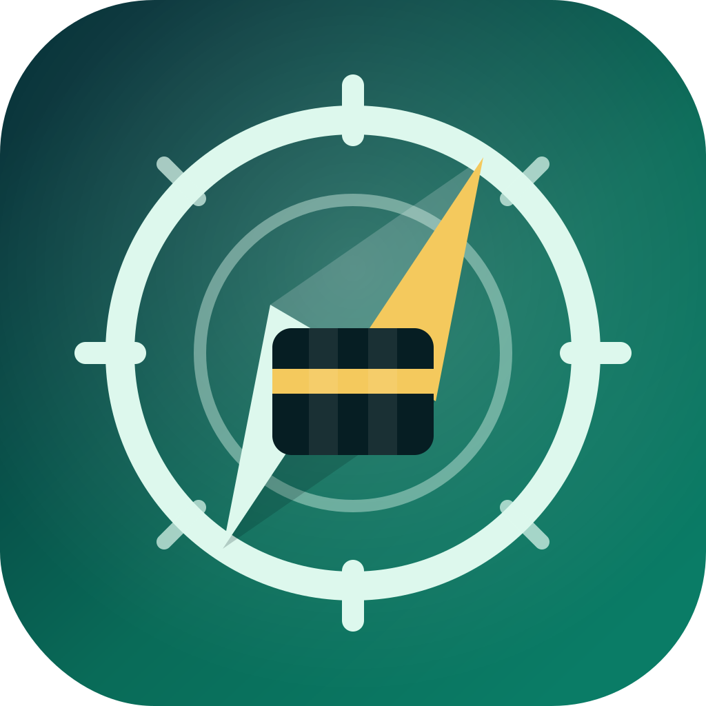

# GeoQibla

<p align="center">
  
</p>

<p align="center">
Kotlin Multiplatform Compose Qibla direction UI for Android and iOS apps.
</p>

<p align="center">

[](https://central.sonatype.com/artifact/io.github.shahidzbi4213/geoqibla)
[](https://github.com/Shahidzbi4213/GeoQibla/releases)
[](https://shahidzbi4213.github.io/GeoQibla/)
[](LICENSE)
</p>

GeoQibla gives Compose Multiplatform apps a ready-made Qibla compass screen, a headless controller for custom UI, and public styling, localization, and slot APIs for product-specific presentation.

Current version: `0.0.1`

## Features

- **Compose-first**: Drop in `GeoQiblaScreen` for a complete adaptive Qibla flow.
- **Cross-platform**: Shared Kotlin API for Android and iOS.
- **Headless control**: Build custom screens from `QiblaController.state`.
- **Location and sensor state**: Permission, settings, calibration, tilt, heading accuracy, and error handling.
- **Configurable behavior**: Alignment thresholds, smoothing, update interval, magnetic limits, haptics, and `onAligned`.
- **Custom presentation**: `QiblaStyle`, `QiblaStrings`, and `QiblaSlots` for theming, RTL text, and region replacement.
- **Reusable components**: Public compass dial, status panel, and state message composables.

## Installation

Add the dependency to your KMP module's `commonMain` source set:

```kotlin
kotlin {
    sourceSets {
        commonMain.dependencies {
            implementation("io.github.shahidzbi4213:geoqibla:0.0.1")
        }
    }
}
```

### Using Version Catalog

Add to `gradle/libs.versions.toml`:

```toml
[versions]
geoqibla = "0.0.1"

[libraries]
geoqibla = { module = "io.github.shahidzbi4213:geoqibla", version.ref = "geoqibla" }
```

Then use it from your KMP module:

```kotlin
kotlin {
    sourceSets {
        commonMain.dependencies {
            implementation(libs.geoqibla)
        }
    }
}
```

### Platform Setup

**Android** - GeoQibla declares foreground location permissions in its Android library manifest:

```xml
<uses-permission android:name="android.permission.ACCESS_COARSE_LOCATION" />
<uses-permission android:name="android.permission.ACCESS_FINE_LOCATION" />
```

Your app still needs to handle Play policy disclosures and test heading behavior on a physical device.

**iOS** - Add location usage text to `Info.plist`:

```xml
<key>NSLocationWhenInUseUsageDescription</key>
<string>GeoQibla uses your location to calculate the direction of the Qibla.</string>
```

## Quick Start

```kotlin
import androidx.compose.runtime.Composable
import com.shahid.tech.qibla.GeoQiblaScreen
import com.shahid.tech.qibla.rememberQiblaController

@Composable
fun QiblaRoute() {
    val controller = rememberQiblaController()

    GeoQiblaScreen(
        controller = controller,
    )
}
```

`GeoQiblaScreen` starts the controller while it is in composition and stops it when it leaves composition.

## Platform Support

| Platform | Minimum | Runtime services |
| --- | --- | --- |
| Android | API 26+ | `LocationManager`, `SensorManager`, foreground location permission |
| iOS | App target supported by your KMP app | `CoreLocation`, heading updates, when-in-use location permission |

Compass behavior should be verified on physical devices. Emulators and simulators are useful for layout and permission-state checks, but not final heading accuracy.

## Configuration

Pass `QiblaConfig` to `rememberQiblaController()`:

```kotlin
val controller = rememberQiblaController(
    config = QiblaConfig(
        nearDegrees = 10f,
        alignedDegrees = 3f,
        stableAlignedDurationMillis = 750L,
        smoothingFactor = 0.15f,
        locationUpdateIntervalMillis = 1_000L,
        tiltLimitDegrees = 55f,
        magneticFieldMinMicrotesla = 25f,
        magneticFieldMaxMicrotesla = 65f,
        hapticsEnabled = true,
        onAligned = {
            // Called after stable alignment.
        },
    ),
)
```

| Property | Default | Description |
| --- | --- | --- |
| `nearDegrees` | `10f` | Direction difference treated as near Qibla. |
| `alignedDegrees` | `3f` | Direction difference treated as aligned. |
| `stableAlignedDurationMillis` | `750L` | Delay before `onAligned` fires. |
| `smoothingFactor` | `0.15f` | Compass heading smoothing, from `0f` to `1f`. |
| `locationUpdateIntervalMillis` | `1_000L` | Location update interval. |
| `tiltLimitDegrees` | `55f` | Tilt threshold before the UI warns the user. |
| `magneticFieldMinMicrotesla` | `25f` | Low magnetic-field calibration threshold. |
| `magneticFieldMaxMicrotesla` | `65f` | High magnetic-field calibration threshold. |
| `hapticsEnabled` | `true` | Enables alignment haptics where supported. |
| `onAligned` | `null` | Callback after stable alignment. |

## Custom UI

Use the controller directly when you want your own screen:

```kotlin
import androidx.compose.runtime.Composable
import androidx.compose.runtime.collectAsState
import androidx.compose.runtime.getValue
import com.shahid.tech.qibla.QiblaUiState
import com.shahid.tech.qibla.rememberQiblaController

@Composable
fun CustomQiblaRoute() {
    val controller = rememberQiblaController()
    val state by controller.state.collectAsState()

    when (state.uiState) {
        QiblaUiState.ALIGNED -> {
            // Render aligned state.
        }
        QiblaUiState.PERMISSION_REQUIRED -> {
            // Show a permission prompt and call controller.requestPermission().
        }
        else -> {
            // Render compass from state.compass and state.location.
        }
    }
}
```

The state model exposes:

- `state.uiState`: high-level UI state such as `LOCATING`, `READY`, `NEAR_QIBLA`, or `ALIGNED`.
- `state.compass`: Qibla bearing, current azimuth, direction delta, distance, tilt, magnetic field, and alignment flags.
- `state.location`: location access, current fix, location-service availability, and address label.
- `state.sensorAccuracy`: heading sensor quality.
- `state.orientationSource`: rotation vector, accelerometer/magnetometer, platform heading, or none.
- `state.errorMessage`: optional platform or controller error text.

## Styling and Slots

Use `QiblaStyle`, `QiblaStrings`, and `QiblaSlots` to customize the default screen without replacing its behavior:

```kotlin
import androidx.compose.ui.graphics.Color
import com.shahid.tech.qibla.GeoQiblaScreen
import com.shahid.tech.qibla.QiblaColors
import com.shahid.tech.qibla.QiblaSlots
import com.shahid.tech.qibla.QiblaStrings
import com.shahid.tech.qibla.QiblaStyle

GeoQiblaScreen(
    controller = controller,
    style = QiblaStyle.default().copy(
        colors = QiblaColors(
            primary = Color(0xFF096B58),
            qibla = Color(0xFF0A7C66),
        ),
    ),
    strings = QiblaStrings.arabic(),
    slots = QiblaSlots(
        topBar = { state ->
            // Custom header.
        },
        actionButtons = { state ->
            // Custom action row.
        },
    ),
)
```

## Public Components

The default screen is built from reusable public components:

| Component | Purpose |
| --- | --- |
| `GeoQiblaScreen` | Complete adaptive screen with lifecycle handling. |
| `QiblaCompassDial` | Compass dial and Qibla pointer. |
| `QiblaStatusPanel` | Bearing, distance, sensor, and location status rows. |
| `QiblaStateMessage` | State-specific message and supporting copy. |

## API Reference

### QiblaController

```kotlin
interface QiblaController {
    val state: StateFlow<QiblaState>

    fun start()
    fun stop()
    fun retryLocation()
    fun requestPermission()
    fun openLocationSettings()
    fun openAppSettings()
    fun dismissCalibration()
}
```

### QiblaState

```kotlin
data class QiblaState(
    val uiState: QiblaUiState = QiblaUiState.IDLE,
    val compass: QiblaCompassState = QiblaCompassState(),
    val location: QiblaLocationState = QiblaLocationState(),
    val sensorAccuracy: QiblaSensorAccuracy = QiblaSensorAccuracy.UNKNOWN,
    val orientationSource: QiblaOrientationSource = QiblaOrientationSource.NONE,
    val isStarted: Boolean = false,
    val errorMessage: String? = null,
)
```

## Troubleshooting

### Compass points the wrong way

Test on a physical device, keep the device flat, and confirm location permission is granted. Emulators and simulators do not provide reliable final heading accuracy.

### Permission state is stuck

Call `controller.requestPermission()` from a user action. If the user permanently denies permission, call `controller.openAppSettings()`.

### Location is disabled

Use `controller.openLocationSettings()` from your UI. The default screen already shows the relevant action for this state.

### Calibration warning appears

Ask the user to move away from magnetic interference and follow the device calibration motion. You can provide a custom calibration region with `QiblaSlots.calibrationSheet`.

## Documentation

- [Getting started](https://shahidzbi4213.github.io/GeoQibla/getting-started/installation/)
- [Configuration](https://shahidzbi4213.github.io/GeoQibla/getting-started/configuration/)
- [Custom UI](https://shahidzbi4213.github.io/GeoQibla/guides/custom-ui/)
- [Platform behavior](https://shahidzbi4213.github.io/GeoQibla/guides/platform-behavior/)
- [Troubleshooting](https://shahidzbi4213.github.io/GeoQibla/troubleshooting/)

## Contributing

Contributions are welcome. See [CONTRIBUTING.md](CONTRIBUTING.md) for local commands, documentation rules, and pull request expectations.

## Support

If GeoQibla helps your app, star the repository and open issues with platform details, device model, OS version, GeoQibla version, and reproduction steps.

## License

```
Apache License 2.0

Copyright 2026 Shahid Iqbal

Licensed under the Apache License, Version 2.0 (the "License");
you may not use this file except in compliance with the License.
You may obtain a copy of the License at

    https://www.apache.org/licenses/LICENSE-2.0

Unless required by applicable law or agreed to in writing, software
distributed under the License is distributed on an "AS IS" BASIS,
WITHOUT WARRANTIES OR CONDITIONS OF ANY KIND, either express or implied.
See the License for the specific language governing permissions and
limitations under the License.
```
